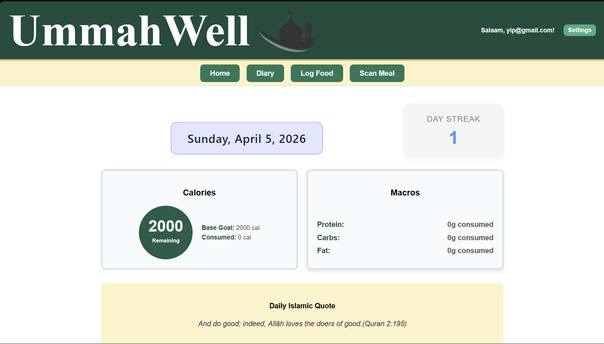
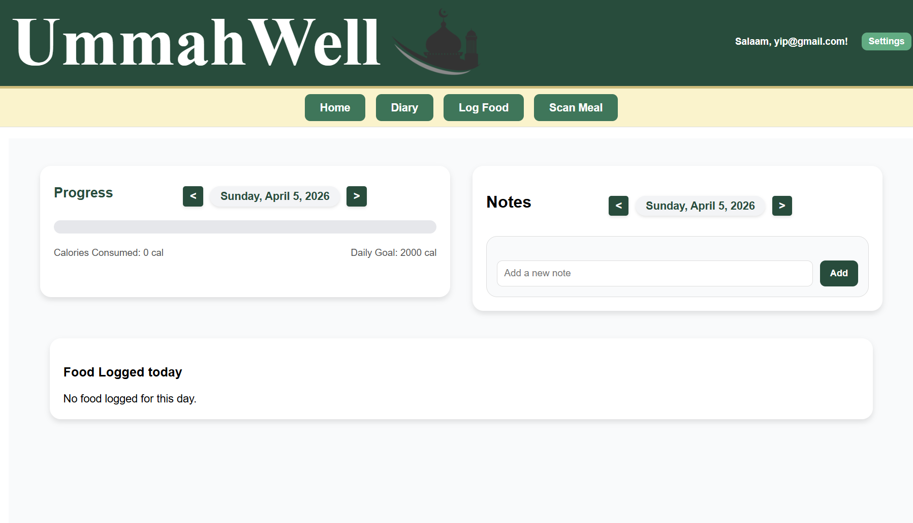
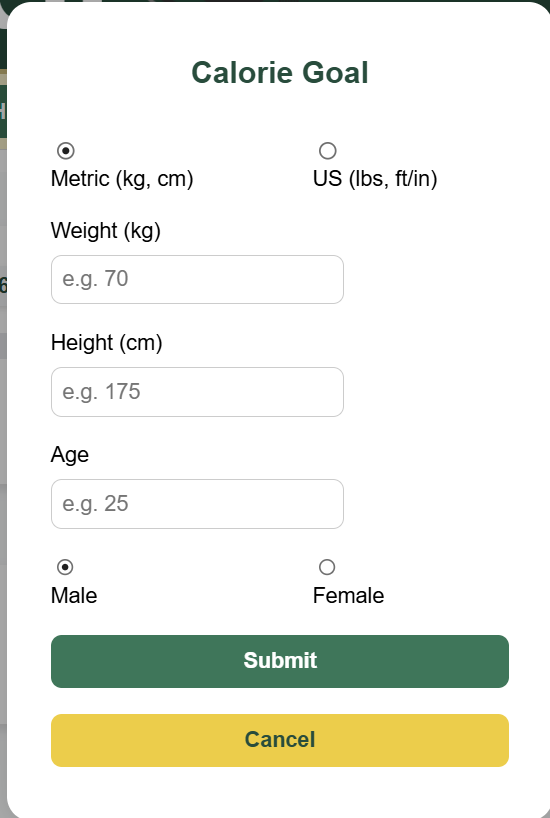
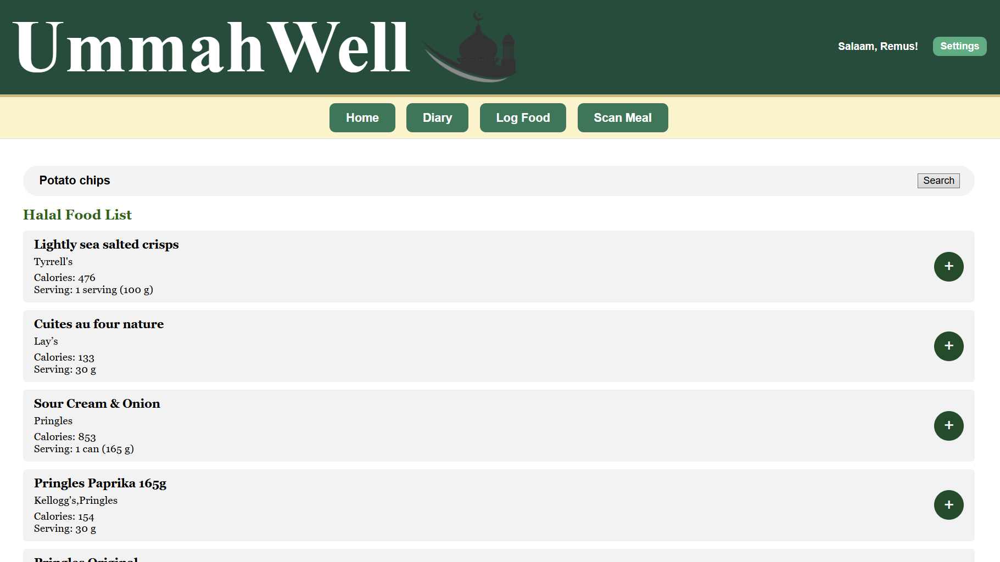
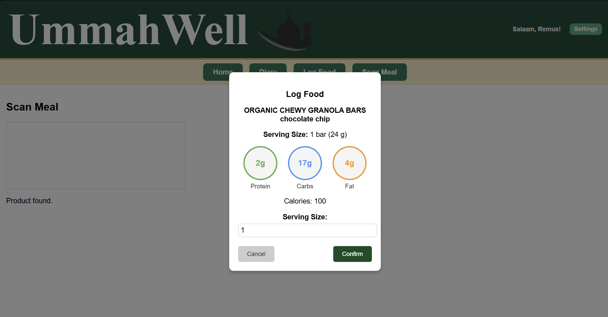

# Ummahwell

A halal-conscious calorie tracking web app built for Muslim users. Ummahwell lets you search foods, log meals to a daily diary, and automatically flags haram ingredients — so you never have to second-guess what you're eating.

Built in 48 hours at MIST Toronto 2025, where it placed **1st**.

## Screenshots

## Features

- Haram ingredient detection — automatically flags non-halal ingredients in food items
- Food search powered by the Nutritionix API with calorie and macro details
- Barcode scanner using ZXing camera library to look up packaged foods instantly
- Daily food diary with calorie tracking bar and goal setting
- Macro breakdown popup for each food item
- Day streak tracker to keep you consistent
- Mobile-responsive design

## Tech Stack

- **Frontend:** React.js
- **Backend/Database:** Firebase
- **APIs:** Nutritionix API, ZXing barcode scanning library

## Getting Started

### Prerequisites
- Node.js installed
- A Nutritionix API key (free tier available at developer.nutritionix.com)
- Firebase project credentials

### Installation

1. Clone the repo

   git clone https://github.com/Remixd1/CalorieTracker.git
   cd CalorieTracker

2. Install dependencies

   npm install

3. Add your environment variables

   Create a .env file in the root directory and add:

   REACT_APP_NUTRITIONIX_APP_ID=your_app_id
   REACT_APP_NUTRITIONIX_API_KEY=your_api_key

4. Start the app

   npm start

Open http://localhost:3000 to view it in your browser.

## Background

Originally developed for the MIST Toronto 2025 hackathon as a solution for Muslim users who struggled to find halal-verified nutritional tracking tools. Most calorie apps don't account for halal dietary restrictions at all, Ummahwell bridges that gap. It aims to provide a convenient and intuitive app to assist the Islamic community stay true to their beliefs.

## Contributors

- Remus (Remixd1) — food search API, diary feature, calorie tracking UI, mobile responsiveness
- Salman (SalmanBurhan2007) - Front-end design, Front-end fucntionality, Islamic Quotes, scan meal page
- Ishan (ovr-hit) - Backend user authenication, data storage, ZXing library implementation and functionality

### Analyzing the Bundle Size

This section has moved here: [https://facebook.github.io/create-react-app/docs/analyzing-the-bundle-size](https://facebook.github.io/create-react-app/docs/analyzing-the-bundle-size)

### Making a Progressive Web App

This section has moved here: [https://facebook.github.io/create-react-app/docs/making-a-progressive-web-app](https://facebook.github.io/create-react-app/docs/making-a-progressive-web-app)

### Advanced Configuration

This section has moved here: [https://facebook.github.io/create-react-app/docs/advanced-configuration](https://facebook.github.io/create-react-app/docs/advanced-configuration)

### Deployment

This section has moved here: [https://facebook.github.io/create-react-app/docs/deployment](https://facebook.github.io/create-react-app/docs/deployment)

### `npm run build` fails to minify

This section has moved here: [https://facebook.github.io/create-react-app/docs/troubleshooting#npm-run-build-fails-to-minify](https://facebook.github.io/create-react-app/docs/troubleshooting#npm-run-build-fails-to-minify)
